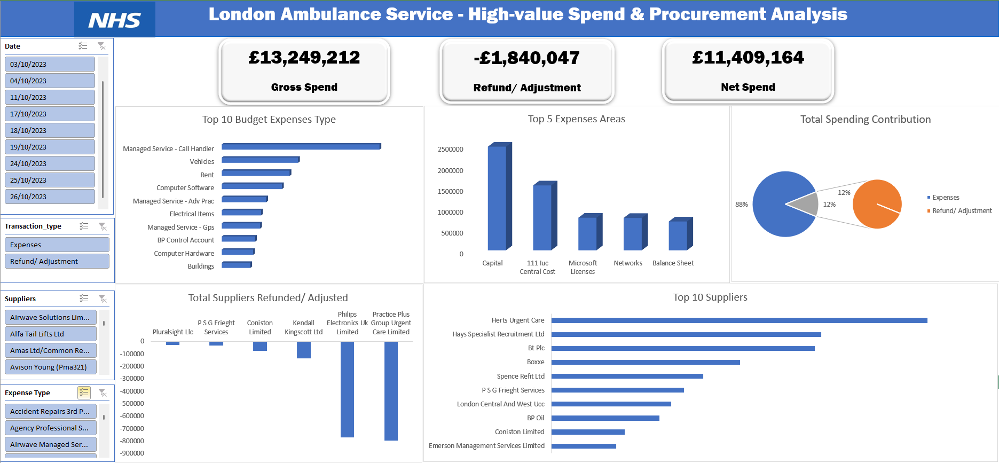
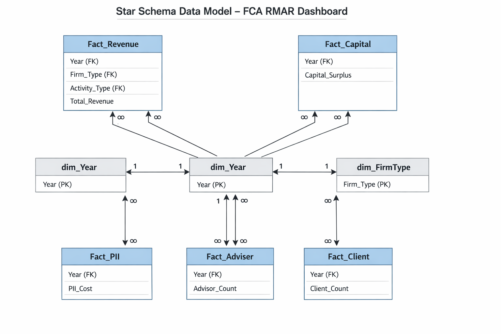
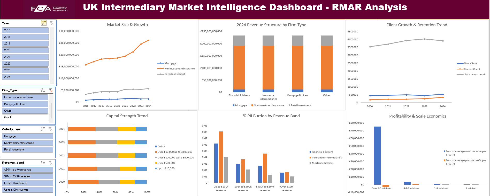

# Data Analytics Portfolio
# Project 1
**Title:** [London Ambulance Service- High-Service Spend & Procurement Analysis](https://github.com/chisomstanley266-collab/chisomstanley266-collab.github.io/blob/main/Transparency%20Report%20solved.xlsx)

**Tool Used:** Microsoft Excel (Pivot Tables, Pivot Chart, Condition Formatting, Text box, Slicer, Power Query Editor)

**Project Description:** Designed and delivered an interactive Excel dashboard analysing NHS high-value transactions (£25k+), transforming raw transparency data into structured financial oversight insights. Implemented pivot-driven analysis, spend classification (gross vs refunds), and supplier concentration modelling. Converted complex financial transactions into executive-ready intelligence, enabling visibility into procurement exposure, budget allocation, and financial adjustments. Built using publicly available NHS transparency data, aligned with government financial reporting standards and procurement governance practices.

**Key Findings:** 
* Raw transparency data lacked structured insight into procurement risk and budget efficiency.
* Develop an executive dashboard to assess spend concentration, supplier dependency, and refund impact.
* Classified transactions into gross and refund categories, modelled net spend, analysed supplier concentration, and evaluated expense allocation patterns.
* Identified £13.25M in gross spend with £1.84M in financial adjustments, resulting in a 12% correction ratio impacting net expenditure.
* Detected supplier concentration risk, with a limited number of vendors accounting for a disproportionate share of total spend.
* Confirmed budget dominance in managed services and capital expenditure, indicating operational and infrastructure cost priorities.
* Highlighted material refund activity significant enough to influence financial oversight and procurement monitoring decisions.
* Demonstrated the ability to interpret public sector financial data beyond surface reporting, focusing on governance, risk exposure, and procurement efficiency.

**Dashboard:**

# Project 2
**Title:** [FCA RMAR Sector Performance & Regulatory Risk Dashboard (2016–2024)](https://github.com/chisomstanley266-collab/chisomstanley266-collab.github.io/blob/main/retail-intermediary-market-2024-underlying-data_solved.xlsx)

**Tool Used:** Microsoft Excel (Advanced Pivot & Data Model), Power Query (Data Cleaning & Transformation), Excel Data Model (Relational Modelling), Star Schema Design, Dimensional Modelling Principles, Regulatory Data (FCA RMAR - November 2025 Publication)

**Project Description:** This project transforms the Financial Conduct Authority’s Retail Mediation Activities Return (RMAR) publication into a structured analytical data model to assess market performance, financial stability, and risk across UK intermediary firms. Over 20 regulatory tables were cleaned and reshaped using Power Query, then modelled using a star schema within Excel’s Data Model. I designed central fact tables for Revenue, Capital, Professional Indemnity Insurance (PII), Adviser, and Client metrics, linked to dimension tables for Year, Firm Type, and Activity Type. The result is an interactive dashboard that converts static regulatory disclosures into strategic sector intelligence, enabling cross-filtered analysis of growth, concentration, solvency, cost pressure, profitability, and client dynamics.

**Key Findings:** 
* Since 2016, total regulated revenue has expanded significantly, driven largely by non-investment insurance activity, while retail investment revenues showed volatility before stabilising in 2024.
* Revenue remains structurally concentrated, with insurance intermediaries accounting for the majority of sector income.
* Capital positions are broadly resilient, with most firms maintaining surpluses above minimum requirements and a declining share operating in deficit.
* Insurance costs place disproportionate pressure on smaller firms, where PII premiums consume a higher percentage of revenue.
* Profitability is strongest among mid-sized adviser firms, suggesting operational scale advantages without the margin compression observed in the largest firms.
* Client numbers remain stable overall, although increased attrition in 2024 indicates emerging competitive or market pressures.

**Star Schema Data Model – FCA RMAR Dashboard:**

**Dashboard:**

