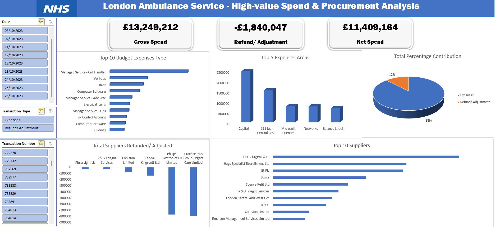

# Data Analyst Portfolio
# Project 1
**Title:** [London Ambulance Service- High-Service Spend & Procurement Analysis](https://github.com/chisomstanley266-collab/chisomstanley266-collab.github.io/blob/main/Transparency%20Report%20solved.xlsx)

**Tool Used:** Microsoft Excel (Pivot Tables, Pivot Chart, Condition Formatting, Text box, Slicer, Power Query Editor)

**Project Description:** Designed and delivered an interactive Excel dashboard analysing NHS high-value transactions (£25k+), transforming raw transparency data into structured financial oversight insights. Implemented pivot-driven analysis, spend classification (gross vs refunds), and supplier concentration modelling. Converted complex financial transactions into executive-ready intelligence, enabling visibility into procurement exposure, budget allocation, and financial adjustments. Built using publicly available NHS transparency data, aligned with government financial reporting standards and procurement governance practices.

**Key Findings:** 
* Raw transparency data lacked structured insight into procurement risk and budget efficiency.
* Develop an executive dashboard to assess spend concentration, supplier dependency, and refund impact.
* Classified transactions into gross and refund categories, modelled net spend, analysed supplier concentration, and evaluated expense allocation patterns.
* Identified £13.25M in gross spend with £1.84M in financial adjustments, resulting in a 12% correction ratio impacting net expenditure.
* Detected supplier concentration risk, with a limited number of vendors accounting for a disproportionate share of total spend.
* Confirmed budget dominance in managed services and capital expenditure, indicating operational and infrastructure cost priorities.
* Highlighted material refund activity significant enough to influence financial oversight and procurement monitoring decisions.
* Demonstrated the ability to interpret public sector financial data beyond surface reporting, focusing on governance, risk exposure, and procurement efficiency.

**Dashboard:**

