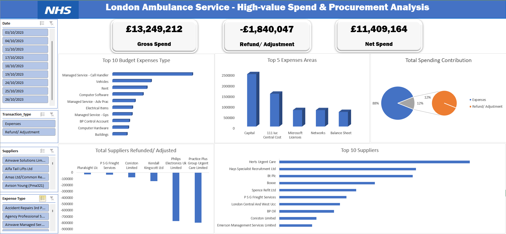
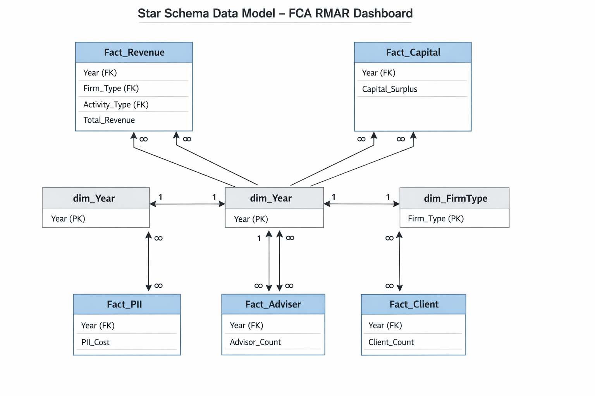
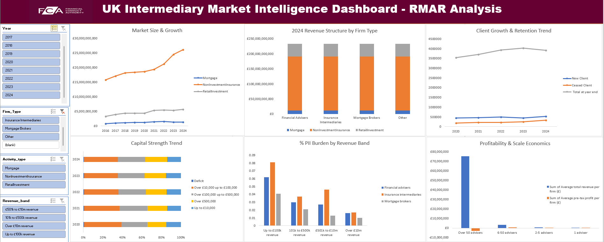
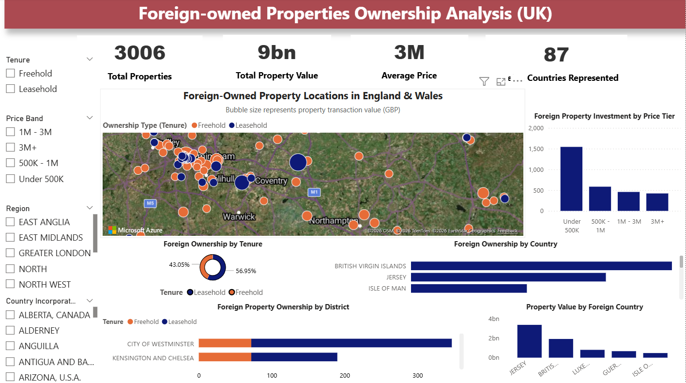
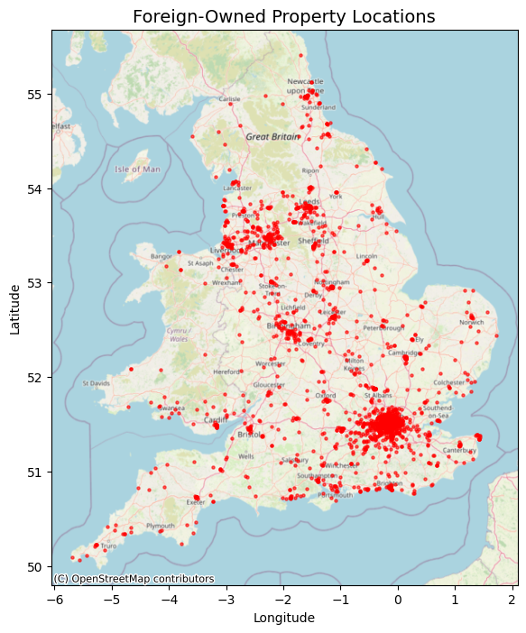
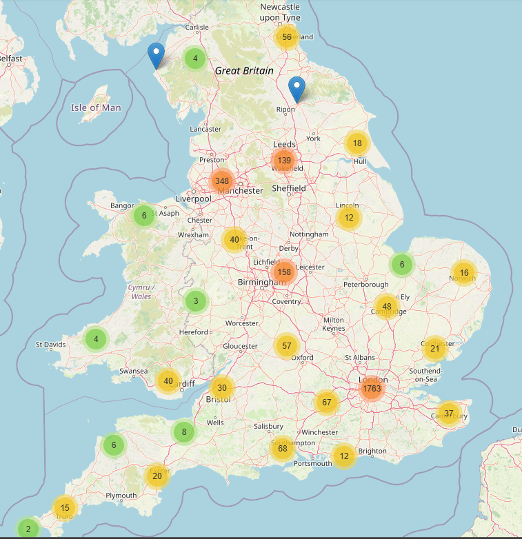
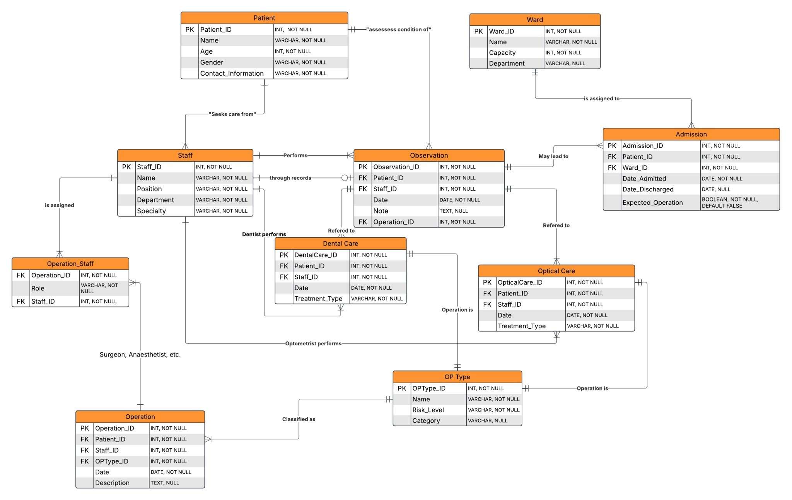
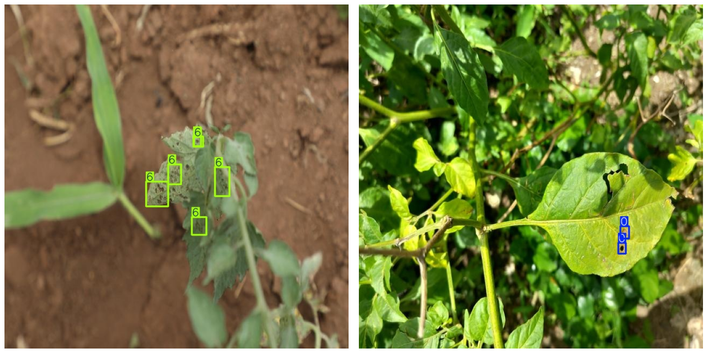
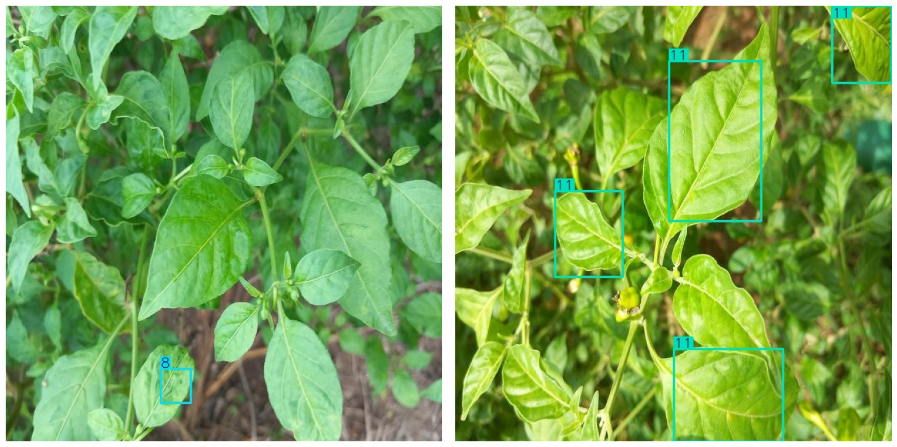

# Data Analytics Portfolio
# Project 1
**Title:** [London Ambulance Service- High-Service Spend & Procurement Analysis](https://github.com/chisomstanley266-collab/chisomstanley266-collab.github.io/blob/main/Transparency%20Report%20solved.xlsx)

**Tool Used:** Microsoft Excel (Pivot Tables, Pivot Chart, Condition Formatting, Text box, Slicer, Power Query Editor)

**Project Description:** Designed and delivered an interactive Excel dashboard analysing NHS high-value transactions (£25k+), transforming raw transparency data into structured financial oversight insights. Implemented pivot-driven analysis, spend classification (gross vs refunds), and supplier concentration modelling. Converted complex financial transactions into executive-ready intelligence, enabling visibility into procurement exposure, budget allocation, and financial adjustments. Built using publicly available NHS transparency data, aligned with government financial reporting standards and procurement governance practices.

**Key Findings:** 
* Raw transparency data lacked structured insight into procurement risk and budget efficiency.
* Develop an executive dashboard to assess spend concentration, supplier dependency, and refund impact.
* Classified transactions into gross and refund categories, modelled net spend, analysed supplier concentration, and evaluated expense allocation patterns.
* Identified £13.25M in gross spend with £1.84M in financial adjustments, resulting in a 12% correction ratio impacting net expenditure.
* Detected supplier concentration risk, with a limited number of vendors accounting for a disproportionate share of total spend.
* Confirmed budget dominance in managed services and capital expenditure, indicating operational and infrastructure cost priorities.
* Highlighted material refund activity significant enough to influence financial oversight and procurement monitoring decisions.
* Demonstrated the ability to interpret public sector financial data beyond surface reporting, focusing on governance, risk exposure, and procurement efficiency.

**Dashboard:**

# Project 2
**Title:** [FCA RMAR Sector Performance & Regulatory Risk Dashboard (2016–2024)](https://github.com/chisomstanley266-collab/chisomstanley266-collab.github.io/blob/main/retail-intermediary-market-2024-underlying-data_solved.xlsx)

**Tool Used:** Microsoft Excel, Advanced Pivot, Power Query, Excel Data Model (Relational Modelling), Star Schema Design, Dimensional Modelling Principles, Regulatory Data (FCA RMAR - November 2025 Publication)

**Project Description:** This project transforms the Financial Conduct Authority’s Retail Mediation Activities Return (RMAR) publication into a structured analytical data model to assess market performance, financial stability, and risk across UK intermediary firms. Over 20 regulatory tables were cleaned and reshaped using Power Query, then modelled using a star schema within Excel’s Data Model. I designed central fact tables for Revenue, Capital, Professional Indemnity Insurance (PII), Adviser, and Client metrics, linked to dimension tables for Year, Firm Type, and Activity Type. The result is an interactive dashboard that converts static regulatory disclosures into strategic sector intelligence, enabling cross-filtered analysis of growth, concentration, solvency, cost pressure, profitability, and client dynamics.

**Key Findings:** 
* Total regulated revenue increased from approximately £19bn in 2016 to over £33bn in 2024, with non-investment insurance accounting for more than £26bn (≈79%) of total 2024 revenue.
* In 2024, insurance intermediaries generated approximately £24.8bn, significantly exceeding financial advisers (£6.2bn) and mortgage brokers (£1.4bn), indicating strong structural concentration within the insurance segment.
* Between 2020 and 2024, the proportion of firms operating in deficit declined, while firms with capital surpluses above £100,000 remained dominant across all firm types, reflecting sustained regulatory solvency strength.
* For firms with revenue under £100k, PII premiums represented up to 8.1% of regulated revenue (insurance intermediaries), compared to approximately 1.0–1.7% for firms earning over £10m, highlighting scale-driven cost efficiency.
* Firms with 6–50 advisers reported average total revenue per firm exceeding £3.2m, with average pre-tax profits above £570k, while firms with over 50 advisers showed margin compression and negative average retained profit.
* Total ongoing clients reached approximately 3.9–4.0 million in 2024, with 534k new clients offset by 335k ceased clients, indicating continued growth but rising churn dynamics.

**Star Schema Data Model – FCA RMAR Dashboard:**

**Dashboard:**

# Project 3
**Title:** [Foreign-Owned Property Ownership Analysis (UK)](https://github.com/chisomstanley266-collab/chisomstanley266-collab.github.io/blob/main/Uk_foregn_properties_powerbi_report.pbix)

**Tools Used:** [Python](https://github.com/chisomstanley266-collab/chisomstanley266-collab.github.io/blob/main/Properties_foreign_owned_script.ipynb), Pandas, Postcodes.io API, Power BI, DAX, Power Query Editor, UK Land Registry Open Data

**Project Description:** This project analyzes the geographic distribution and ownership structure of foreign-owned properties in England and Wales. The objective is to uncover spatial patterns in overseas property investment and understand how ownership types such as Freehold and Leasehold are distributed across districts and regions. The dataset was sourced from the UK Land Registry Overseas Companies Ownership dataset. Because the raw dataset contains postcodes rather than geographic coordinates, Python was used to enrich the data by converting postcodes into latitude and longitude using the postcodes.io API. The processed dataset was then imported into Power BI where data modeling and DAX measures were applied to build an interactive geospatial dashboard. The final dashboard allows exploration of foreign property ownership patterns through location mapping, tenure comparison, country ownership analysis, and property value aggregation.

**Dataset Source:** HM Land Registry — [Overseas companies that own property in England and Wales](https://use-land-property-data.service.gov.uk/datasets/ccod)

**Key Findings:** 
* Foreign-owned properties are heavily concentrated in Greater London, with the highest density observed in districts such as the City of Westminster and Kensington & Chelsea, confirming London as the primary hub for overseas real estate investment.
* Leasehold ownership dominates foreign-held property titles, accounting for roughly 57% of the dataset, reflecting the prevalence of apartment developments and managed residential buildings in urban markets.
* Foreign property ownership is strongly linked to offshore financial jurisdictions, with British Virgin Islands, Jersey, and the Isle of Man appearing as the most frequent locations of incorporation for overseas property-holding entities.
* Mid-market properties dominate foreign investment activity, with the £500K–£1M price band containing the largest number of properties, indicating that international investors are not focused solely on ultra-luxury real estate.
* High-value properties (£3M+) represent a smaller but strategically concentrated segment, primarily located in central London districts, suggesting targeted acquisition of premium assets.
* Foreign property investment exhibits a clear urban preference, with significantly higher concentrations in major metropolitan areas compared to rural districts.

**Dashboard Report:**

# Project 4
**Title:** Sun Medical Hospital Database Design and Healthcare Data Modelling Project

**SQL code:** [Sun Medical Hospital Database Design (DDL)](https://github.com/chisomstanley266-collab/chisomstanley266-collab.github.io/blob/main/healthcare_DDL)

**SQL skills used:** SQL Server, T-SQL, ERD Design, DDL, Crow’s Foot Notation, Database Normalisation, Relational Database Modelling

**Project Descriptions:** Designed a relational database model for Sun Medical Hospital to manage patient care, staff responsibilities, admissions, wards, observations, specialist treatments, and surgical operations. The project focused on creating a scalable healthcare database structure that supports accurate record keeping, data integrity, and efficient querying across clinical and operational processes. The database was modelled using Crow’s Foot notation and converted into SQL Server T-SQL scripts with primary keys, foreign keys, constraints, bridge tables, validation rules, and indexing. The design supports one-to-many and many-to-many relationships, particularly where multiple staff members may be assigned to a single operation with different roles.

**Key Findings:** 
* Designed a structured healthcare database that connects patients, staff, wards, admissions, observations, and operations.
* Implemented relational integrity using primary keys, foreign keys, CHECK constraints, UNIQUE constraints, and NOT NULL rules.
* Added an Operation_Staff bridge table to correctly model many-to-many relationships between operations and medical staff.
* Improved data quality by applying validation rules for age, gender, discharge dates, risk level, staff roles, and ward capacity.
* Supported healthcare workflow tracking from patient admission through observation, specialist care, and surgical procedures.
* Created indexed fields to improve query performance across high-use relationships such as patients, admissions, observations, and operations.

  **Image:**
  

# Project 5

**Title:** Crop Disease Detection using YOLOv8n & YOLOv11s

**Python codes:** [YOLOv8n](https://github.com/chisomstanley266-collab/chisomstanley266-collab.github.io/blob/main/COM752_yolov8_S24011767.ipynb), [YOLOv11s](https://github.com/chisomstanley266-collab/chisomstanley266-collab.github.io/blob/main/COM752_yolov11_S24011767.ipynb)

**Skills:** Python, PyTorch, Ultralytics YOLO, Computer vision, OpenCV,  Pandas,  NumPy,  Google Colab (GPU),  Roboflow, Matplotlib, Seaborn

**Data Source:** [Ghana Crop Disease Dataset (Kaggle)](https://www.kaggle.com/datasets/ohagwucollinspatrick/ghana-crop-disease)

**Project Description:** This project investigates the effectiveness of deep learning–based object detection models for crop disease localisation using real-world agricultural imagery. Two models, YOLOv8n and YOLOv11s, were evaluated under both augmented and non-augmented training conditions. The study adopts a data-centric approach, focusing not only on model performance but also on how dataset characteristics such as class imbalance, annotation quality, and small object prevalence influence detection outcomes. The goal is to understand whether improvements in model architecture alone are sufficient for reliable agricultural disease detection.

**Key Findings:**
* YOLOv11s performed better than YOLOv8n (+~0.05 mAP@50)
* Performance capped around 0.30 – 0.38 mAP@50 → dataset limitation
* Data augmentation had minimal impact
* Class imbalance caused uneven detection across diseases
* Small disease regions (lesions) reduced detection accuracy
* Models converged well but hit an early performance ceiling
* Data quality mattered more than model complexity

  **Visual evidence of the test data:**
  ### YOLOv8n-
  

  ### YOLOv11s-
  
